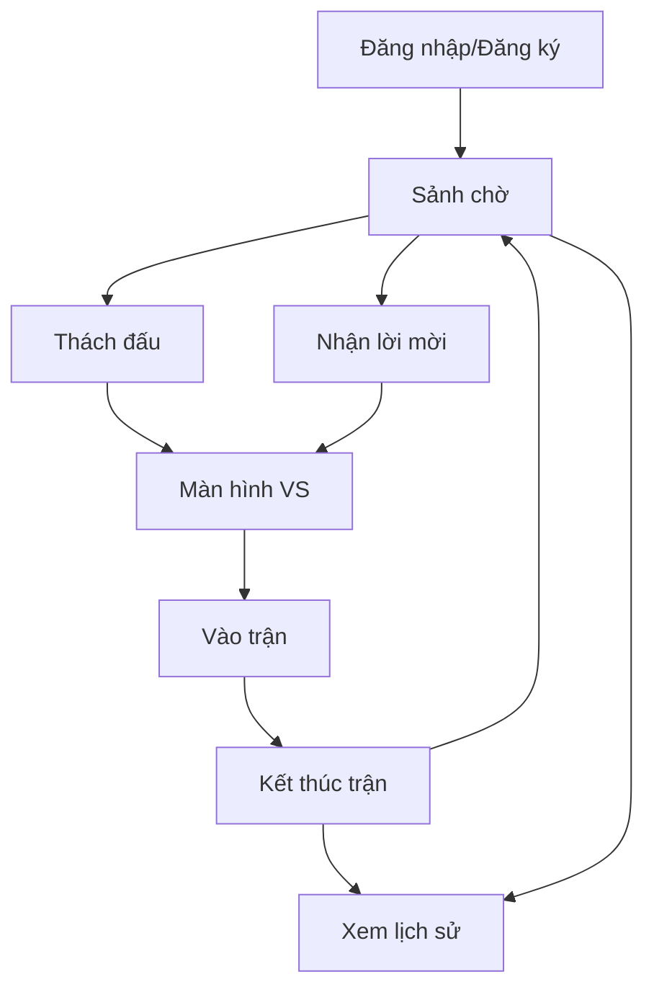

# Sudoku Battle 🎮

> Game đối kháng Sudoku 1v1 được xây dựng bằng React và Python

## 🎯 Tổng quan

Một trò chơi Sudoku đối kháng thời gian thực, cho phép người chơi:

- Đăng nhập/Đăng ký tài khoản
- Thách đấu người chơi khác đang online
- Thi đấu Sudoku theo thời gian thực
- Xem lịch sử các trận đấu

## 🔄 Luồng hoạt động



## 📁 Cấu trúc thư mục

### Components chính

```
src/
├── components/
│   ├── AuthWrapper.jsx    # Quản lý xác thực
│   ├── LoginScreen.jsx    # Màn hình đăng nhập
│   ├── RegisterScreen.jsx # Màn hình đăng ký
│   ├── Lobby.jsx         # Sảnh chờ
│   ├── Maingame.jsx      # Màn hình chơi game
│   └── MatchResult.jsx    # Kết quả trận đấu
```

## 🎮 Chức năng chính

### 1. Xác thực (`AuthWrapper.jsx`)

- Quản lý luồng đăng nhập/đăng ký
- Chuyển đổi giữa hai màn hình xác thực

### 2. Sảnh chờ (`Lobby.jsx`)

- Hiển thị danh sách người chơi online/offline
- Chức năng thách đấu
- Quản lý thông tin cá nhân

### 3. Trận đấu (`Maingame.jsx`)

- Bảng Sudoku 9x9
- Công cụ hỗ trợ:
  - ✏️ Bút chì (ghi chú)
  - 🧹 Cục tẩy
  - 💡 Gợi ý
- ⏲️ Đồng hồ đếm ngược
- 💬 Chat với đối thủ


### 4. Kết quả (`MatchResult.jsx`)

- Thông báo người chiến thắng
- Thống kê trận đấu:
  - ⏱️ Thời gian hoàn thành
  - ❌ Số lỗi
  - 🤔 Thời gian suy nghĩ

### 5. Lịch sử (`History.jsx`)

- Xem lại các trận đấu đã chơi
- Thông tin chi tiết:
  - 📅 Ngày giờ
  - 👤 Đối thủ
  - 🏆 Kết quả
  - ⌛ Thời gian


